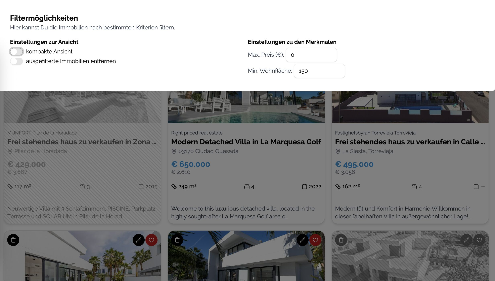

# House compare

This is a private project to collect favorite real estates to be able to compare them. You can add as many real estates you want and also
entering the data is done half-automatic or completely manually.

Because websites do not like webcrawling, there is a half-automatic import for idealista links by using pasted HTML source. I tried different things for crawling but
captcha hits hard and could not get it done in less effort (tried puppeteer, playwright, proxy, ...).

## ideas for future implementations

- add translation of description possibility
- share links via datenkommo.de
- store in database (datenkommo.de)
- add personal notes
- show map on compare
- show map when entering location
- filter by countries (if more than one)
- big map with all favorites
- image as base64 instead of link due to permission issues
- auto get coords for idealista
- own domain instead of github pages?
- make big menu instead of smalle buttons
- domainnames: collecthomes, maisonlist

## features

- add whats new screen/info screen
- set real estate data manually or from idealista html
- possibility to add coordinates instead of location
- export and import of data
- storage in browser
- store your favorite collection
- comparison of real estates by user selection (up to 3)
- add starting point to calculate distance (air)
- works on mobile and desktop
- detect countries

## Some insights

### Overview

Collect all your favorite real estates. Mark them by click on the heart and go into compare mode.


Some filters help to reduce your favorites to focus on your criterias.



### Location

You can define a starting point and the (air) distance is calculated to give you a better understanding of the place.


## dependencies used

- nextjs for client and server
- tailwind css
- ~~cheerio (server api parses the HTML here)~~ replaced with DOM parsing to be deployable on GH pages
- lucide-react for nice symbols
- motion for microanimations

## Getting Started

First, run the development server:

```bash
npm run dev
```

Open [http://localhost:3000](http://localhost:3000) with your browser to see the result.
