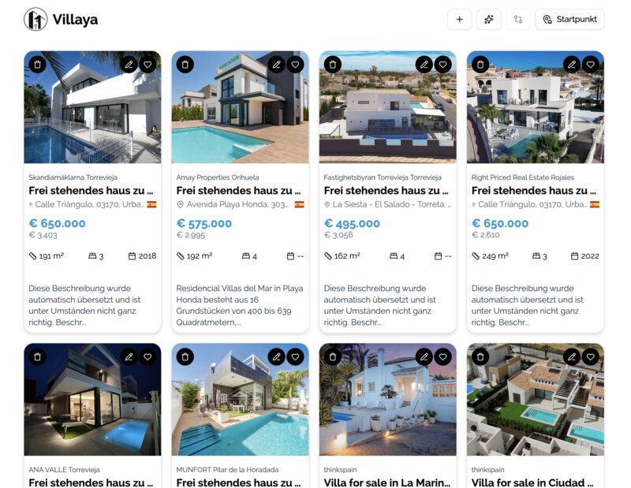
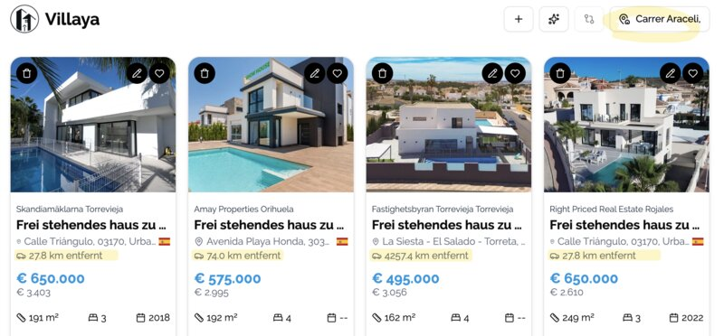

# Villaya

This is a private project to collect favorite real estates to be able to compare them. You can add as many real estates you want and also
entering the data is done half-automatic or completely manually.

Because websites do not like webcrawling, there is a half-automatic import for idealista and thinkspain links by using pasted HTML source. I tried different things for crawling but
captcha hits hard and could not get it done in less effort (tried puppeteer, playwright, proxy, ...).

## ideas for future implementations

-  ~~map via toggle on main listing page instead of separate page~~
-  ~~more colorful tilelayer~~
-  ~~comparison does not look good on mobile~~ better but not perfect
-  ~~details with indicator which field has empty data~~
-  topscore with more checks (year should be removed)
-  ~~personal ranking as new field (db + details)~~
-  add translation of description possibility
-  ~~show map on compare~~

## finding a domain name

This was harder than expected. I asked chatGPT a lot and also used services like namelix.com. The results were awesome but nothing really kicked.
So I used namelix.com examples and threw them into chatgpt to match them against my requirements.
Here are the top 3 results.

🏆 Top 3 Gesamt (nach deinem Konzept)

1. Villaya ⭐ 9/10
    → Emotional, weich, klingt modern & markenfähig. Villa + Gefühl = Herz & Verstand in einem.
    → Würde sich super als App-/Web-Brand machen.

2. EstateMate ⭐ 9/10
    → Smart, menschlich, sozial. „Dein Begleiter bei der Haussuche.“
    → Passt perfekt zum Teilen-Feature und zum Vergleichs-Charakter.

3. CollectHomes ⭐ 9/10
    → Funktional & logisch, ideal für Fokus auf Vergleich & Sammlung.
    → Neutraler, aber universell einsetzbar.

## features

-  add whats new screen/info screen
-  set real estate data manually or from idealista and thinkspain html
-  possibility to add coordinates instead of location
-  storage in browser
-  store your favorite collection
-  comparison of real estates by user selection (up to 3)
-  add starting point to calculate distance (air)
-  works on mobile and desktop
-  detect countries

## Some insights

### Overview

All you need is your email address so the data can be stored in the database.

In case the email address is recognized by the system you will be redirected to your list of favorites. Otherwise
an email is send with a confirmation code before you can start.

### Location

You can define a starting point and the (air) distance is calculated to give you a better understanding of the place.

## dependencies used

-  nextjs for client ~~and server~~
-  tailwind css
-  ~~cheerio (server api parses the HTML here)~~ replaced with DOM parsing to be deployable on GH pages
-  lucide icons for nice symbols
-  animated-ui for microanimations
-  motion for microanimations
