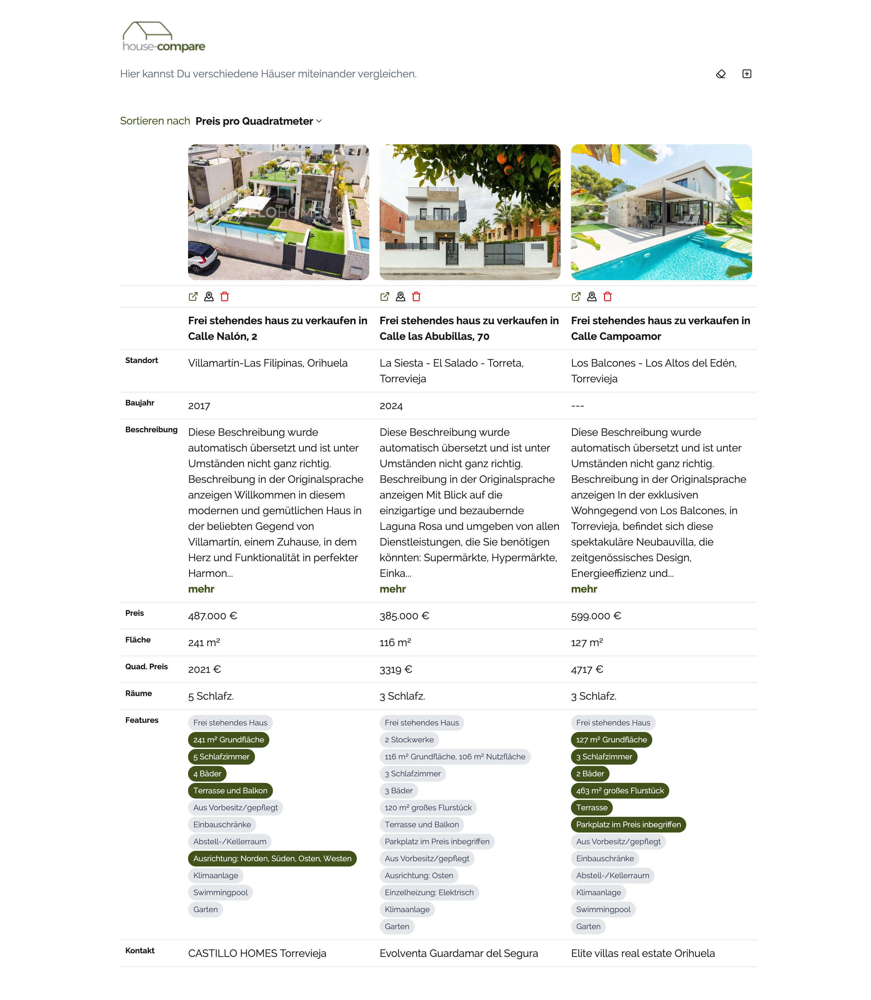

# house-compare

This is a small project to compare different houses (from idealista) and show them enxt to each other.
Sorting can be changed by dropdown.

Because websites do not like webcrawling, I decided to add new data by using pasted HTML source. I tried different things for crawling but
captcha hits hard and could not get it done in less effort (tried puppeteer, playwright).

## Some insights



## dependencies used

- nextjs for client ~~and server~~
- tailwind css
- ~~cheerio (server api parses the HTML here)~~ replaced with DOM parsing to be deployable on GH pages
- lucide-react for nice symbols

## possible improvements

- store data in indexdb (fallbacks to localstorage)
- add search
- add manual in a nice way
- rewrite cheerio to client based parsing
- more sorting possibilities
- ~~add map link on location~~
- ~~highlight features only one house has~~
- ~~extract build year from response (server)~~
- ~~remove energy details (server)~~
- ~~better navigation (show arrows instead of scrolling)~~
- ~~put action at the top~~
- ~~add url as link~~
- micro-animations
- smarter comparison view

## Getting Started

First, run the development server:

```bash
npm run dev
```

Open [http://localhost:3000](http://localhost:3000) with your browser to see the result.
