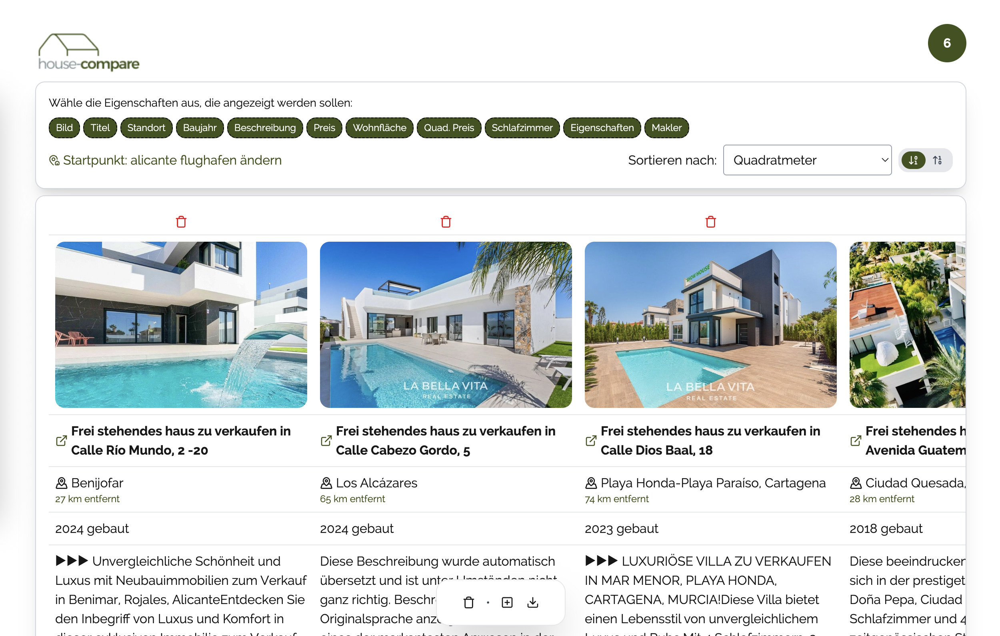

# house-compare

This is a small project to compare different houses (from idealista) and show them enxt to each other.
Sorting can be changed by dropdown.

Because websites do not like webcrawling, I decided to add new data by using pasted HTML source. I tried different things for crawling but
captcha hits hard and could not get it done in less effort (tried puppeteer, playwright).

## features

- set real estate data manually or from idealista html
- filter options to show/hide attributes
- sorting possibility (ascending/descending) for attributes
- redirect to google map
- export and import of data
- storage in browser
- add starting point to calculate distance (air)

## some additional ideas to think about

- ...

## Some insights

### Overview

This is the overview where you can sort, filter and compare your dream houses.



### Location

You can define a starting point and the (air) distance is calculated to give you a better understanding of the place.


## dependencies used

- nextjs for client ~~and server~~
- tailwind css
- ~~cheerio (server api parses the HTML here)~~ replaced with DOM parsing to be deployable on GH pages
- lucide-react for nice symbols
- motion for microanimations

## Getting Started

First, run the development server:

```bash
npm run dev
```

Open [http://localhost:3000](http://localhost:3000) with your browser to see the result.
