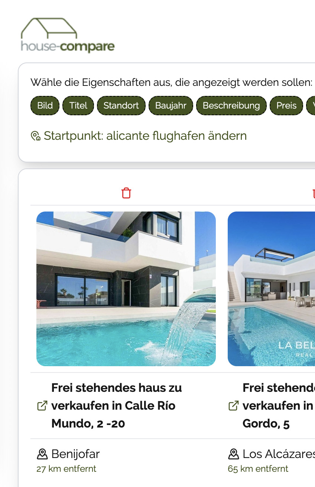

# house-compare

This is a private project to collect favorite real estates to be able to compare them. You can add as many real estates you want and also
entering the data is done half-automatic or completely manually.

Because websites do not like webcrawling, there is a half-automatic import for idealista links by using pasted HTML source. I tried different things for crawling but
captcha hits hard and could not get it done in less effort (tried puppeteer, playwright, proxy, ...).

## ideas for future implementations

- add translation of description possibility
- edit some attributes later
- share links via datenkommo.de
- add personal notes
- show map on compare
- show map when entering location
- native language filtgering via input line (maybe use panel)
- show preview in overview

## features

- set real estate data manually or from idealista html
- redirect to google map
- export and import of data
- storage in browser
- add starting point to calculate distance (air)

## Some insights

### Overview

This is the overview where you can sort, filter and compare your dream houses.


### Location

You can define a starting point and the (air) distance is calculated to give you a better understanding of the place.



## dependencies used

- nextjs for client ~~and server~~
- tailwind css
- ~~cheerio (server api parses the HTML here)~~ replaced with DOM parsing to be deployable on GH pages
- lucide-react for nice symbols
- motion for microanimations

## Getting Started

First, run the development server:

```bash
npm run dev
```

Open [http://localhost:3000](http://localhost:3000) with your browser to see the result.
